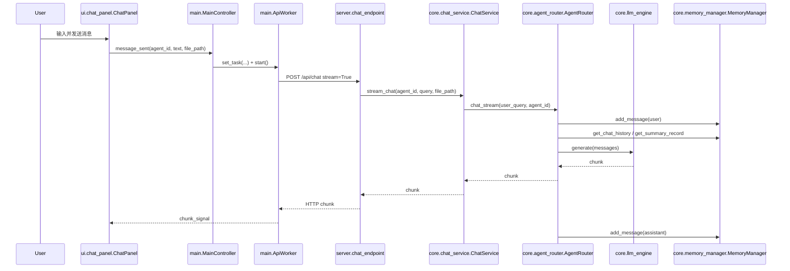
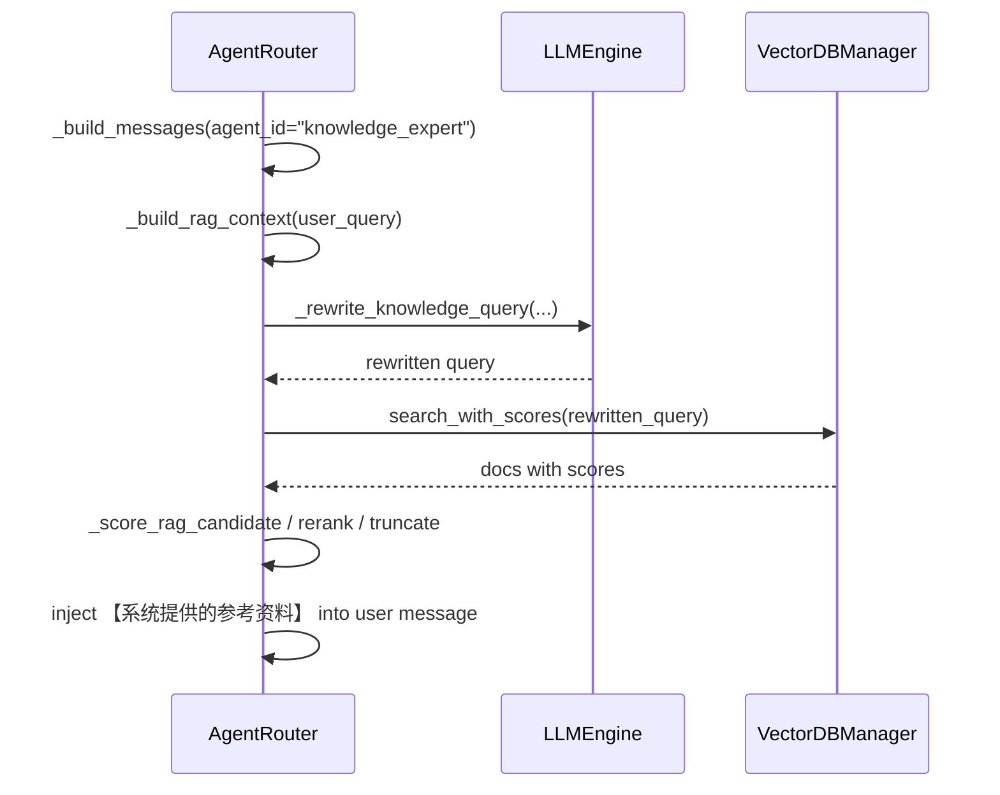
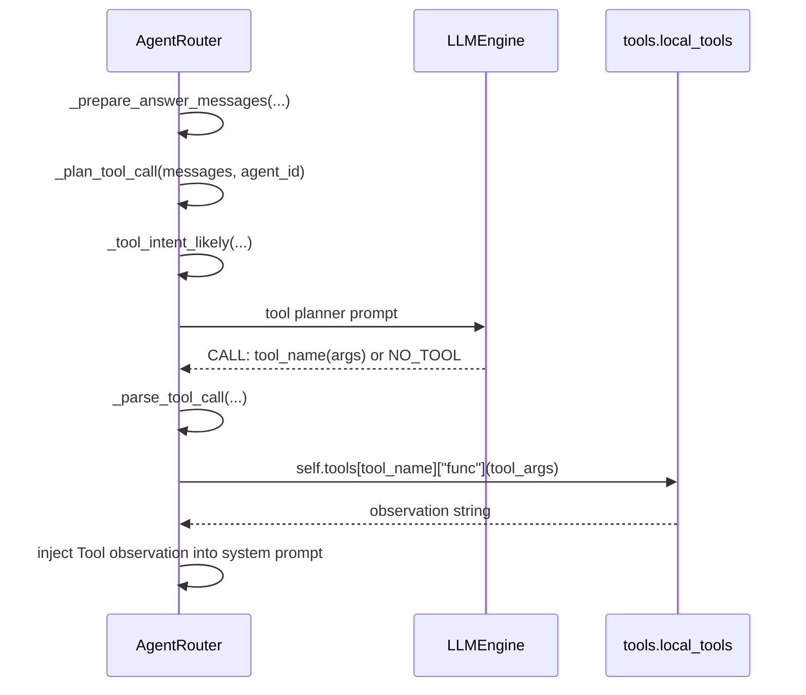
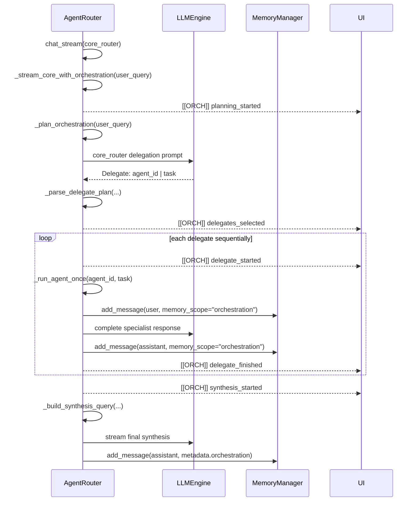
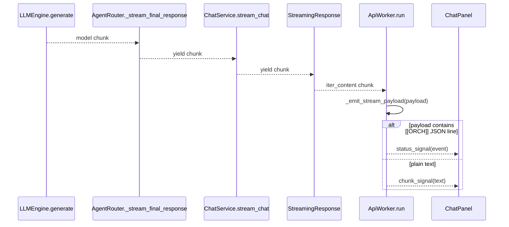

# 阶段二第 1 天改造结果

## 1. 本次任务目标

本次任务属于“阶段二第 1 天：Agent Framework、Agent Harness 与 Agent Runtime 的边界分析”。目标是在不修改生产代码、测试代码、配置或依赖的前提下，基于 LocalAgent 当前真实代码完成一次请求调用链、关键职责入口、职责混杂点和未来最小 Runtime 边界的分析落库。

本次明确不实现以下后续能力：`run_id`、RunContext、AgentState、显式 Agent Loop、State Machine、Scheduler、Checkpoint、Runtime、Tool Registry、Agent Skill、MCP、A2A、Sandbox 或独立评估平台能力。

## 2. 修改前现状

项目当前由 PyQt6 桌面端和 FastAPI 后端组成。桌面端通过 HTTP 调用后端 `/api/chat`，后端通过 `ChatService` 转调 `AgentRouter`。`AgentRouter` 目前集中承担路由、提示词构造、工具规划、工具调用、RAG 上下文构造、多 Agent 委派、模型调用、流式输出和 Memory 持久化等职责。

主要入口如下：

| 能力 | 文件 / 类 / 函数 | 当前职责 |
|---|---|---|
| PyQt6 用户输入入口 | `ui/chat_panel.py::ChatPanel._emit_message()` | 收集输入文本和附件路径，向控制器发出 `message_sent` 信号 |
| PyQt6 请求控制 | `main.py::MainController._handle_user_message()` | 设置 `ApiWorker` 任务并启动后台线程 |
| PyQt6 后端通信 | `main.py::ApiWorker.run()` | POST `/api/chat`，读取流式响应，解析 `[[ORCH]]` |
| FastAPI 请求入口 | `server.py::chat_endpoint()` | 接收聊天请求并返回 `StreamingResponse` |
| 应用服务入口 | `core/chat_service.py::ChatService.stream_chat()` | 拼接附件路径并转调 `AgentRouter.chat_stream()` |
| 主要编排入口 | `core/agent_router.py::AgentRouter.chat_stream()` | 写入用户消息，判断是否进入多 Agent 编排或单 Agent 流式回答 |
| 模型适配入口 | `core/llm_engine.py::LocalLLMEngine.generate()` / `RemoteLLMEngine.generate()` | 本地 llama-cpp 或远端 OpenAI 兼容模型调用 |
| Tool 注册入口 | `tools/registry.py::register_all_tools()` | 将内置工具注册到 `AgentRouter` |
| Tool 实现入口 | `tools/local_tools.py` | 本地文件、Excel/CSV、系统状态工具 |
| RAG 检索入口 | `core/agent_router.py::AgentRouter._build_rag_context()` | 触发知识库查询并构造参考资料上下文 |
| Chroma 封装 | `core/knowledge_base/vector_db_manager.py::VectorDBManager` | 管理 Chroma 向量库检索 |
| Memory 封装 | `core/memory_manager.py::MemoryManager` | 管理 SQLite 消息、摘要和全文检索 |
| `[[ORCH]]` 事件生成 | `core/agent_router.py::AgentRouter._build_orchestration_event()` | 生成嵌入文本流的 JSON 行 |
| `[[ORCH]]` 事件消费 | `main.py::ApiWorker._emit_stream_payload()` | 从响应文本中拆出编排状态事件并发给 UI |

## 3. 发现的问题

### 3.1 `AgentRouter` 职责高度混杂

`core/agent_router.py::AgentRouter` 当前不只是 Router，也不是纯 Agent Harness。它是一个职责混杂的遗留编排器，同时承担：

- Agent 配置和选择；
- 系统提示词构造；
- 工具规划与工具调用；
- RAG 检索词重写、检索、重排和上下文注入；
- Memory 读取、写入、摘要压缩；
- 单 Agent 流式执行；
- 多 Agent 委派规划、专属 Agent 顺序执行和最终汇总；
- `[[ORCH]]` 编排事件生成；
- 部分异常降级逻辑。

因此未来建立 Runtime 边界时，应把 `AgentRouter` 视为遗留编排器，并通过兼容适配器暂时接入 Runtime，而不是直接把它定义为纯净的 Agent Harness。

### 3.2 API 流式协议与 Runtime Event 混合

`server.py::chat_endpoint()` 返回 `StreamingResponse(..., media_type="text/event-stream")`，但实际产出的内容是普通文本 chunk 与 `[[ORCH]]{json}\n` 混合流。当前不能在未确认标准 SSE 帧格式前直接认定它是标准 SSE；更准确地说，它是使用 `text/event-stream` media type 的自定义流式 HTTP 协议。

`core/agent_router.py::_build_orchestration_event()` 直接生成面向前端解析的 `[[ORCH]]` 文本标记，`main.py::ApiWorker._emit_stream_payload()` 直接消费该协议。这说明内部编排事件、前端协议和 UI 状态展示当前耦合在一起。

### 3.3 缺少统一 Run 概念

当前没有统一、显式的 Run 概念，也没有稳定的 `run_id`、`session_id` 或 `trace_id`。一次请求由以下对象隐式组成：

- UI 侧 `main.py::ApiWorker` 的一次任务；
- FastAPI 侧 `server.py::chat_endpoint()` 的一次 generator；
- 应用服务侧 `core/chat_service.py::ChatService.stream_chat()` 的一次调用；
- 编排侧 `core/agent_router.py::AgentRouter.chat_stream()` 的一次 generator。

这些对象之间没有统一的 Run 生命周期、状态查询、取消传播或恢复机制。

### 3.4 Memory 与 Runtime State 未区分

`core/memory_manager.py::MemoryManager` 管理 SQLite 会话消息、摘要和搜索能力。它保存的是 Conversation Memory 和部分 orchestration 轨迹，不是 Runtime State。当前用户会话状态、编排轨迹、执行结果和摘要维护存在混用风险。

### 3.5 异常类型容易丢失

`server.py::chat_endpoint()` 内部的 `generate()` 捕获异常后产出普通文本 `\n[server-error] {exc}`。`tools/local_tools.py` 中的工具函数也普遍捕获异常并返回错误字符串。这种方式有利于不中断 UI 显示，但会丢失错误类型、错误阶段、是否可重试等 Runtime 需要的信息。

### 3.6 取消机制没有端到端传播

`main.py::ApiWorker.cancel()` 通过 `requestInterruption()`、关闭 response 和 session 尝试取消前端请求，但后端 `server.py::chat_endpoint()`、`core/chat_service.py::ChatService.stream_chat()`、`core/agent_router.py::AgentRouter.chat_stream()`、LLM、Tool、RAG 均没有显式取消 token 或取消检查。因此当前取消不具备稳定的端到端传播语义。

## 4. 最终设计方案

本次只输出未来最小改造方案，不实施生产代码修改。

推荐调用方向：

```text
UI / Client
  -> API / Transport
    -> ChatService / Application Service
      -> RunService
        -> Runtime
          -> Compatibility Adapter
            -> Legacy AgentRouter
              -> Model Adapter
              -> Tool
              -> RAG / Retrieval
              -> Memory
```

职责建议：

| 层级 | 推荐职责 |
|---|---|
| UI / Client | 发起请求、展示普通文本和编排状态、提供用户级取消入口 |
| API / Transport | 校验请求、管理 HTTP 流式协议、把 Runtime Event 适配为现有普通文本和 `[[ORCH]]` 格式 |
| ChatService | 应用服务门面，保持现有 API 调用稳定，转调 RunService |
| RunService | 负责启动、查询、取消、恢复等应用用例；不直接承载底层状态机细节 |
| Runtime | 负责 Run 生命周期、状态控制、取消传播、错误边界和内部 Runtime Event |
| Compatibility Adapter | 暂时包装职责混杂的遗留 `AgentRouter`，减少一次性改造风险 |
| AgentRouter | 短期保留为遗留编排器，继续提供现有路由、RAG、Tool、多 Agent 和流式能力 |
| Model Adapter | 保持在 `core/llm_engine.py`，只负责模型网络或本地推理适配 |
| Tool | 保持在 `tools/local_tools.py`，只负责工具业务实现 |
| RAG / Retrieval | 保持在 `core/knowledge_base`，只负责文档加载、向量检索和知识库基础能力 |
| Memory | 保持在 `core/memory_manager.py`，只负责 Conversation Memory 和持久化访问 |

最小迁移顺序建议：

1. 在 `core/chat_service.py::ChatService.stream_chat()` 与 `core/agent_router.py::AgentRouter.chat_stream()` 之间增加 RunService 边界。
2. 通过兼容适配器包装 `AgentRouter`，不要先移动 RAG、Tool、Memory、Model 代码。
3. API 层继续保持 `/api/chat` 请求体和现有流式输出兼容。
4. 内部 Runtime Event 不直接等同于 `[[ORCH]]`；由流式协议适配层转换为现有普通文本和 `[[ORCH]]` 格式。
5. 后续再逐步引入取消传播、状态查询、失败状态、恢复语义等能力。

## 5. 新增文件

- `docs/learning/stage2/day01_runtime_boundary_result.md`

## 6. 修改文件

- 无生产代码修改。
- 无测试代码修改。
- 无配置文件修改。
- 无依赖文件修改。

## 7. 核心类、接口和数据结构

### 7.1 `main.py::ApiWorker`

- 当前职责：在 UI 线程之外发起 `/api/chat` 请求，读取流式 HTTP 响应，解析 `[[ORCH]]`，向 UI 发出文本 chunk 和状态事件。
- 调用方：`main.py::MainController._handle_user_message()`。
- 被调用方：后端 `server.py::chat_endpoint()`。
- 判断依据：`run()` 中调用 `session.post(..., stream=True)`，并遍历 `response.iter_content(...)`；`_emit_stream_payload()` 中查找 `ORCHESTRATION_EVENT_PREFIX`。

### 7.2 `server.py::chat_endpoint()`

- 当前职责：FastAPI `/api/chat` 请求入口，返回流式响应。
- 调用方：`main.py::ApiWorker.run()`。
- 被调用方：`core/chat_service.py::ChatService.stream_chat()`。
- 判断依据：`@app.post("/api/chat")` 装饰器、`StreamingResponse(generate(), media_type="text/event-stream")`、`yield from service.stream_chat(...)`。

### 7.3 `core/chat_service.py::ChatService`

- 当前职责：应用服务门面，暴露聊天、历史、搜索、记忆管理操作。
- 调用方：`server.py` 中各 API endpoint。
- 被调用方：`core.agent_router.AgentRouter` 和其 `memory_manager`。
- 判断依据：`stream_chat()` 拼接附件路径后 `yield from self.router.chat_stream(...)`，历史和记忆接口直接访问 `self.router.memory_manager`。

### 7.4 `core/agent_router.py::AgentRouter`

- 当前职责：职责混杂的遗留编排器。它同时承担 Router、Planner、多 Agent 编排、部分 Agent Harness、执行循环雏形、Tool 调用、RAG 调用、Memory 读写和 `[[ORCH]]` 事件生成。
- 调用方：`core/chat_service.py::ChatService`、`tools/registry.py::register_all_tools()`。
- 被调用方：`core.llm_engine`、`core.memory_manager`、`core.knowledge_base.vector_db_manager`、`tools.local_tools` 注册进来的函数。
- 判断依据：`chat_stream()`、`_stream_core_with_orchestration()`、`_prepare_answer_messages()`、`_build_rag_context()`、`_run_agent_once()`、`_build_orchestration_event()` 分别覆盖执行、编排、工具、RAG、Memory、事件等职责。

### 7.5 `core/llm_engine.py::LocalLLMEngine` 和 `RemoteLLMEngine`

- 当前职责：模型适配层。
- 调用方：`AgentRouter`。
- 被调用方：本地 `llama_cpp.Llama` 或远端 OpenAI 兼容 HTTP API。
- 判断依据：二者均提供 `generate(messages, temperature, max_tokens)` generator 接口。

### 7.6 `core/memory_manager.py::MemoryManager`

- 当前职责：SQLite Conversation Memory、摘要和搜索。
- 调用方：`AgentRouter`、`ChatService`。
- 被调用方：SQLite。
- 判断依据：`add_message()`、`get_chat_history()`、`save_summary()`、`search_messages()`、`clear_all_memory()`。

### 7.7 `core/knowledge_base/vector_db_manager.py::VectorDBManager`

- 当前职责：Chroma 向量库检索封装。
- 调用方：`AgentRouter._build_rag_context()`。
- 被调用方：`langchain_chroma.Chroma`。
- 判断依据：提供 `search()`、`search_with_scores()`、`similarity_search()`、`similarity_search_with_scores()`。

### 7.8 `tools/registry.py` 和 `tools/local_tools.py`

- 当前职责：注册和实现内置本地工具。
- 调用方：`server.py::lifespan()` 调用 `register_all_tools(router)`；`AgentRouter._prepare_answer_messages()` 执行已注册工具。
- 被调用方：文件系统、pandas、psutil。
- 判断依据：`register_all_tools()` 调用 `router.register_tool(...)`，本地工具函数返回字符串 observation。

## 8. 关键执行流程

### 8.1 普通问答调用链



文字说明：用户消息由 `ChatPanel._emit_message()` 发出，经 `MainController._handle_user_message()` 启动 `ApiWorker.run()`。后端 `server.py::chat_endpoint()` 使用 `StreamingResponse` 桥接 `ChatService.stream_chat()`。`ChatService` 只做轻量 query 拼接，然后进入 `AgentRouter.chat_stream()`。`AgentRouter` 写入用户消息、构造上下文、调用 LLM、流式返回 chunk，并在结束后写入 assistant 消息。

### 8.2 RAG 调用链



文字说明：RAG 只在 `agent_id == "knowledge_expert"` 且 `db_manager` 存在时触发。`AgentRouter._build_messages()` 调用 `_build_rag_context()`，其中先用 LLM 重写检索词，再调用 `VectorDBManager.search_with_scores()` 或降级到 `search()`，然后重排、去重、截断并注入用户消息。

### 8.3 Tool 调用链



文字说明：工具不是由独立 Tool Runtime 调度，而是在 `AgentRouter._prepare_answer_messages()` 中直接规划和执行。规划阶段由 `_plan_tool_call()` 调用模型生成 `CALL: tool_name(args)`，解析后直接执行 `self.tools[tool_name]["func"](tool_args)`。工具异常通常被工具函数内部捕获并作为字符串返回。

### 8.4 多 Agent 调用链



文字说明：多 Agent 仅在 `agent_id == "core_router"` 且 `orchestration_enabled` 时触发。委派计划由核心 Agent 通过文本 `Delegate: agent_id | task` 生成，再由 `_parse_delegate_plan()` 解析。专属 Agent 当前按 for-loop 顺序执行，不是并行执行。执行轨迹写入 `memory_scope="orchestration"`。

### 8.5 流式输出调用链



文字说明：后端使用 `StreamingResponse` 传输流式内容，但当前输出不是标准 SSE `data:` 帧，而是普通文本 chunk 和 `[[ORCH]]{json}\n` 的混合协议。前端通过 `ApiWorker._emit_stream_payload()` 在文本流中识别协议前缀。

## 9. 与现有功能的兼容方式

未来最小改造应保持以下兼容点：

- 保持 `/api/chat` 请求体中的 `agent_id`、`query`、`file_path` 不变。
- 保持 `server.py::chat_endpoint()` 对前端的流式返回能力不变。
- 保持普通文本 chunk 的 UI 渲染方式不变。
- 保持现有 `[[ORCH]]{json}\n` 前端协议不变。
- 保持 `MemoryManager` 的 SQLite schema 暂不变化。
- 保持 `AgentRouter.chat_stream()` 的可调用性，通过兼容适配器接入未来 Runtime。
- 不把 Model、Tool、RAG、Memory 业务实现迁入 Runtime 核心。

## 10. 异常处理和边界情况

当前异常处理情况：

- `server.py::chat_endpoint()` 将后端异常转换为普通文本 `\n[server-error] {exc}`。
- `server.py::lifespan()` 初始化 Chroma 失败时打印 `[Server] Vector DB disabled: {exc}` 并降级为无 RAG。
- `tools/local_tools.py` 中 `list_files_in_dir()` 和 `analyze_excel_data()` 捕获异常并返回错误字符串。
- `core/agent_router.py::_update_summary_if_needed()` 中摘要生成异常会降级到 `_fallback_summary()`。
- `RemoteLLMEngine.generate()` 将 HTTP 错误、非 JSON 响应和空内容转换为 `RuntimeError`。

边界情况：

- 客户端取消只在 UI 侧关闭 HTTP response/session，没有后端取消 token。
- 多 Agent 委派是顺序执行，不是并行执行。
- Tool 没有统一超时、重试、权限、审计或状态回滚机制。
- RAG 查询失败会在 `_build_rag_context()` 中从 `search_with_scores()` 降级到 `search()`，但更深层异常仍可能向外传播。
- Memory 写入和模型生成没有统一事务边界；用户消息可能已写入而 assistant 生成失败。

## 11. 测试内容

本次为文档落库，不修改生产代码、测试代码、配置或依赖。

本次未执行模型调用、服务启动、UI 启动、数据库写入型测试或依赖真实外部服务的测试。原因如下：

- 仓库中未发现测试目录或测试文件。
- 项目依赖本地模型文件、llama-cpp、Chroma、PyQt6、本地 SQLite 数据库等环境。
- 本次任务目标是基于已完成的只读分析结果进行文档落库，不应为了测试而触发模型推理、服务启动或业务数据写入。

## 12. 实际执行的测试命令

阶段二第 1 天只读分析过程中实际执行过以下静态检查命令：

```bash
pwd; find .. -name AGENTS.md -print; rg --files -g '!*__pycache__*' | sed -n '1,120p'
```

```bash
find .. -name AGENTS.md -print -maxdepth 4; rg --files | sort; rg -n "FastAPI|APIRouter|@app|StreamingResponse|EventSource|SSE|ORCH|orch|Router|Planner|Agent|tool|memory|rag|chroma|sqlite|async def|def " main.py server.py core tools ui tests 2>/dev/null | sed -n '1,240p'
```

```bash
sed -n '1,260p' core/agent_router.py; sed -n '1,140p' core/chat_service.py; sed -n '1,220p' server.py; sed -n '1,190p' core/llm_engine.py
```

```bash
sed -n '260,620p' core/agent_router.py; sed -n '1,280p' core/memory_manager.py; sed -n '620,760p' ui/chat_panel.py; sed -n '1,180p' main.py
```

```bash
sed -n '180,420p' main.py; sed -n '620,980p' core/agent_router.py; sed -n '280,560p' core/memory_manager.py; sed -n '1,140p' tools/registry.py; sed -n '1,140p' tools/local_tools.py; sed -n '1,200p' pyproject.toml
```

```bash
git status --short; find . -maxdepth 3 -type d | sort | sed -n '1,120p'; rg --files -g '*test*' -g 'tests/**' | sort
```

本次文档落库阶段未执行测试命令。

## 13. 测试结果

- 静态文件和代码阅读命令执行成功。
- 未发现 `AGENTS.md`。
- 未发现测试目录或测试文件。
- 未执行 `pytest`、服务启动、UI 启动或模型推理。
- 未发现由于本次文档落库引入的生产代码风险，因为未修改生产代码。

## 14. 未完成事项

本次未完成且不应在第 1 天实施的事项：

- 未实现 RunService。
- 未实现 Runtime。
- 未实现 `run_id`。
- 未实现 RunContext。
- 未实现 AgentState。
- 未实现显式状态驱动 Agent Loop。
- 未实现状态机。
- 未实现 Scheduler。
- 未实现 Checkpoint。
- 未修改 API 行为。
- 未修改流式协议。
- 未拆分 `AgentRouter`。
- 未移动 Tool、RAG、Memory、Model 代码。

## 15. 已知风险

- `AgentRouter` 是当前最大职责混杂点，未来直接在其内部继续追加 Runtime 能力会扩大技术债。
- 当前没有统一 Run 生命周期，难以稳定支持查询、取消、恢复、失败分类和追踪。
- 当前 `[[ORCH]]` 同时承担内部编排状态和前端协议，未来引入 Runtime Event 时需要避免继续耦合。
- 当前异常经常被转换为普通文本，后续错误治理、重试和可观测性会受限。
- 当前取消没有端到端传播，长时间模型推理或工具执行可能无法及时停止。
- 当前多 Agent 委派为顺序执行，不具备并行调度能力。
- 当前 Memory 保存的是 Conversation Memory 和部分编排轨迹，不能直接等同 Runtime State。

## 16. 设计权衡

1. **为什么先建立边界而不是重写**

   当前项目已有可运行的聊天、RAG、Tool、Memory 和多 Agent 编排能力。直接重写 `AgentRouter` 风险较高，容易破坏现有 UI、流式输出和本地模型调用。因此应先通过 RunService 与 Runtime 边界包裹现有能力，再逐步拆分职责。

2. **如何看待当前 `AgentRouter`**

   当前 AgentRouter 应视为职责混杂的遗留编排器，不应直接认定为纯 Agent Harness。它短期可以通过兼容适配器接入未来 Runtime，但长期需要逐步拆出 Runtime 控制、协议事件、Memory 访问、Tool 执行治理等职责。

3. **RunService 与 Runtime 的边界**

   RunService 更适合承担应用用例层职责，例如启动、查询、取消、恢复等入口编排。Run 生命周期和状态控制主要属于 Runtime。换言之，RunService 是应用服务门面，Runtime 才负责执行状态、生命周期推进、取消传播和内部事件。

4. **Runtime Event 与现有流式协议的边界**

   Runtime Event 到现有普通文本和 `[[ORCH]]` 格式的转换应属于流式协议适配层，不属于 Runtime 核心。Runtime 核心不应直接依赖 `[[ORCH]]` 字符串前缀。

5. **关于当前 `text/event-stream` 的判断**

   当前接口虽然使用 text/event-stream，但输出可能是自定义流式 HTTP 协议。由于代码中没有标准 SSE `data:` 帧格式，不能在未确认帧格式前直接认定为标准 SSE。

6. **关于 Agent Loop 的判断**

   当前存在执行流程和循环雏形，例如 `_stream_final_response()` 负责模型流式生成，`_stream_core_with_orchestration()` 负责委派循环，`_run_agent_once()` 负责非流式专属 Agent 执行。但这些流程尚未形成统一、显式、状态驱动的 Agent Loop。

## 17. 可用于面试的项目描述

这个项目已经具备 PyQt6 前端、FastAPI 后端、本地和远程模型适配、RAG、SQLite Memory、工具调用和多 Agent 编排等能力，但目前更像是一个功能集合，而不是边界清晰的生产级 Agent Runtime。

通过代码分析可以看到，当前 `AgentRouter` 同时负责路由决策、提示词构造、工具规划、工具调用、RAG 检索、模型调用、多 Agent 委派、流式输出和 Memory 持久化，属于职责混杂的遗留编排器。`[[ORCH]]` 也同时承担了内部编排状态和前端协议的职责。异常和取消机制还没有形成统一的生命周期管理。

因此后续演进不适合直接重写，而应该先在 `ChatService` 与 `AgentRouter` 之间建立 RunService / Runtime 边界。RunService 负责启动、查询、取消、恢复等应用用例，Runtime 负责 Run 生命周期和状态控制；现有 `AgentRouter` 可以先通过兼容适配器接入 Runtime。这样既能保持现有 `/api/chat` 和流式输出兼容，又能逐步补齐 run 生命周期、Runtime Event、取消传播和状态治理能力。

## 18. 需要带回 ChatGPT 审查的信息

### 18.1 本次最重要的设计决策

最重要的设计决策是：不要把当前 `AgentRouter` 直接定义为纯 Agent Harness，也不要在它内部继续堆叠 Runtime 能力。应将它视为职责混杂的遗留编排器，未来通过兼容适配器暂时接入 Runtime。

### 18.2 当前真实调用链

当前真实调用链为：

```text
ui.chat_panel.ChatPanel._emit_message()
  -> main.MainController._handle_user_message()
  -> main.ApiWorker.run()
  -> server.chat_endpoint()
  -> core.chat_service.ChatService.stream_chat()
  -> core.agent_router.AgentRouter.chat_stream()
  -> AgentRouter._stream_core_with_orchestration() 或 _stream_single_agent()
  -> AgentRouter._stream_final_response()
  -> core.llm_engine.LocalLLMEngine.generate() 或 RemoteLLMEngine.generate()
```

### 18.3 与原有理解相比的新发现

- `AgentRouter` 不只是 Router，也不是纯 Agent Harness，而是遗留编排器。
- `text/event-stream` 当前承载的是普通文本 chunk 与 `[[ORCH]]` 的混合协议，不能直接等同标准 SSE。
- 多 Agent 委派当前是顺序执行，不是并行执行。
- 当前存在执行流程和循环雏形，但尚未形成统一、显式、状态驱动的 Agent Loop。
- Memory 中的 `memory_scope="orchestration"` 是编排轨迹的一种存储方式，但不是 Runtime State。

### 18.4 最严重的三个职责混杂点

1. `core/agent_router.py::AgentRouter` 同时承担 Router、Planner、遗留编排器、执行循环雏形、Tool 调用、RAG、Memory、多 Agent 和事件生成。
2. `core/agent_router.py::_build_orchestration_event()` 与 `main.py::ApiWorker._emit_stream_payload()` 将内部编排状态和前端流式协议耦合在 `[[ORCH]]` 文本标记中。
3. `server.py::chat_endpoint()` 直接桥接应用 generator，并把异常转换为普通文本，缺少结构化错误边界。

### 18.5 推荐的 Runtime 接入位置

推荐在以下位置之间接入：

```text
core.chat_service.ChatService.stream_chat()
  -> RunService
  -> Runtime
  -> Compatibility Adapter
  -> core.agent_router.AgentRouter.chat_stream()
```

RunService 负责启动、查询、取消、恢复等应用用例。Run 生命周期和状态控制主要属于 Runtime。Runtime Event 到现有普通文本和 `[[ORCH]]` 格式的转换属于流式协议适配层，不属于 Runtime 核心。

### 18.6 尚不确定的问题

- 是否允许在保持 `/api/chat` 请求体不变的前提下，由服务端内部生成 `run_id`。
- 现有前端取消后，后端是否应该立即中止模型推理，还是允许当前生成自然结束。
- `memory_scope="orchestration"` 的数据未来是否需要展示给用户，还是仅作为内部轨迹。
- 当前远程模型 `RemoteLLMEngine.generate()` 使用 `stream=False`，未来是否需要与本地模型统一为真正流式。
- 当前 `text/event-stream` 是否需要保持 media type，还是未来改为明确的标准 SSE 帧格式。

### 18.7 测试失败或无法执行的原因

本次未执行测试。原因是仓库未发现测试目录或测试文件，且项目依赖本地模型、llama-cpp、Chroma、PyQt6 和本地数据库。阶段二第 1 天目标是分析和文档落库，不应启动服务、调用真实模型或写入业务数据。

### 18.8 后续建议

后续建议仅限方向，不在本次实施：

- 先增加 RunService / Runtime 边界，不拆生产代码。
- 保持现有 `AgentRouter` 通过兼容适配器接入。
- 区分 Runtime Event 与 `[[ORCH]]` 前端协议。
- 区分 Conversation Memory 与 Runtime State。
- 在后续阶段再讨论取消传播、状态查询、失败分类和恢复能力。
